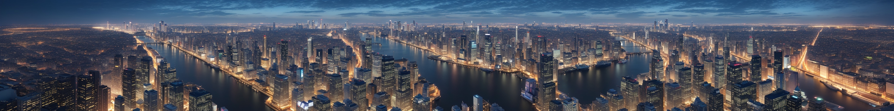
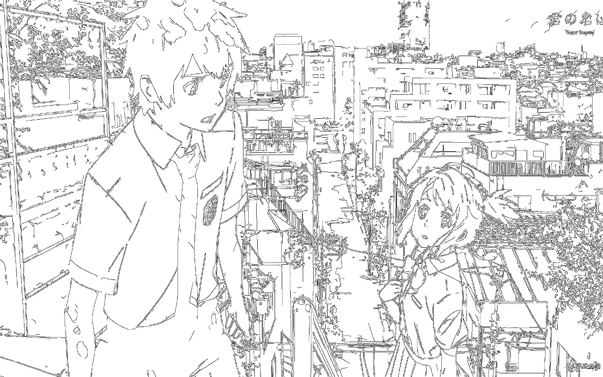
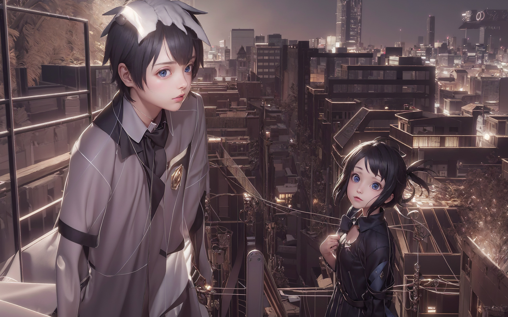
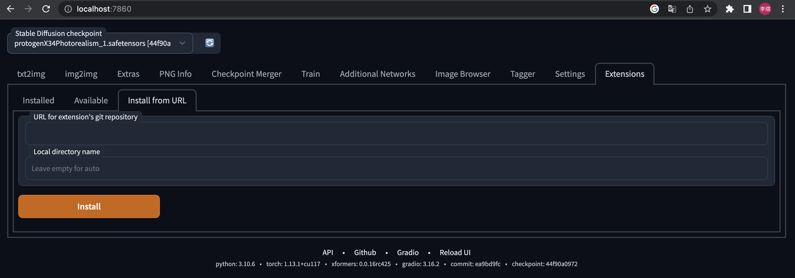

# MultiDiffusion with Tiled VAE

This repository contains two scripts that enable the processing of **ultra-large images** using the [MultiDiffusion](multidiffusion.github.io) and Tiled VAE

## MultiDiffusion

### Features

- **Wide Image Generation**
  - txt2img panorama generation, as mentioned in MultiDiffusion.
    - All tiles shares the same prompt currently.
    - **So please use simple positive prompts to get good results**, otherwise the result will be pool.
    - We are urgently working on the rectangular & fine-grained prompt control and is about to complete.

  - Example - mastepiece, best quality, highres, city skyline, night.
  - 

- **Compatible with ControlNet**, produces wide images with controlled content.
  - Currently, though you cannot use complex prompts, you can use ControlNet to fully control the contents.
    - Canny edge seems to be the best as it provides sufficient local controls.
  - Example: 22020 x 1080 ultra wide image conversion 
    - Masterpiece, best quality, highres, ultra detailed 8k unity wallpaper, bird's-eye view, trees, ancient architectures, stones, farms, crowd, pedestrians
    - Before: [click for raw image](imgs/ancient_city_origin.jpeg)
    - 
    - After: [click for raw image](imgs/ancient_city.jpeg)
    - 
  - Example: 2560 * 1280 large image drawing with controlnet
    - ControlNet canny edge
    - 
    - 
- **img2img for ultra-large images redraw**
  - **MultiDiffusion is especially good at adding details to upscaled images.**
  - We combine it with upscalers and obtain much finer results than SD Upscalers, and higher speed than highres.
  - It is more robust to larger denoise strength (e.g., 0.4-0.6) compare to SD Upscaler and Ultimate SD Upscaler
  - Example: 1024 * 800 -> 4096 * 3200 image, denoise=0.4, steps=20, DPM++ SDE Karras
    - Before: 
    - 
    - After:
    - 

### Advantages

- Draw super large resolutions (2k~8k) for both txt2img and img2img
- Seamless output without any post-processing
- No need to train a new model

### Drawbacks

- We haven't optimize it much, so it can be **slow especially for very large images** (8k) and with controlnet.
- **Prompt control is weak.** It will produce repeated patterns with strong positive prompt, and the result may not be usable.
- The gradient calculation is not compatible with this hack. It will break any backward() or torch.autograd.grad() that passes UNet.

### How it works (so simple!)

1. The latent image is split into tiles.
2. The tiles are denoised by the original sampler.
3. The tiles are added together, but divided by how many times each pixel is added.

## Tiled VAE

**This script is currently production-ready**

The `vae_optimize.py` script is a wild hack that splits the image into tiles, encodes each tile separately, and merges the result back together. This process allows the VAE to work with giant images on limited VRAM (~10 GB for 8K images!). Remove --lowvram and --medvram to enjoy!

### Advantages

- The tiled VAE work with giant images on limited VRAM (~12 GB for 8K images!), eliminate your need for --lowvram and --medvram.
- Unlike [my friend's implementation](https://github.com/Kahsolt/stable-diffusion-webui-vae-tile-infer) and huggingface diffuser's VAE tiling options that averages the tile borders, this VAE tiling removed attention blocks and use padding tricks.  The decoding results mathematically identical to that of not tiling, i.e., **it will not produce seams at all.**
- The script is extremely optimized with tons of tricks. Cannot be faster!

### Drawbacks

- Large RAM (e.g., 20 GB for a 4096*4096 image and 50GB for a 8k image) is still needed to store the intermediate results. If you use --no-half-vae the usage doubles.
- For >=8k images NaNs ocassionally appear in.  The 840000 VAE weights effectively save the . You may use --no-half-vae to disable half VAE for that giant image. **We are figure out the root cause and trying to fix**
- The speed is limited by both your GPU and your CPU. So if any of them is not good, the speed will be affected.
- Similarly, the gradient calculation is not compatible with this hack. It will break any backward() or torch.autograd.grad() that passes VAE.

### How it works

1. The image is gracefully split into tiles and equiped with 11/32 pixels' padding in decoder/encoder.
2. The original VAE forward is decomposed into a task queue and a task worker. The task queue is executed on one tile
3. When group_norm is required, it suspends, stores tensors to cpu, and switches to the other tile.
4. After group_norm are summarized, it swith back and continue. A zigzag behavior is used to reduce unnecessary data transfer.
5. After all tiles are processed, tiles are merged and returned.

## Installation

- Open Automatic1111 WebUI -> Click Tab "Extensions" -> Click Tab "Install from URL" -> type in the link of this repo -> Click "Install" 
- 
- After restart your WebUI, you shall see the following two tabs:
- 

### MultiDiffusion Params

- Latent tile width & height: Basically, multidiffusion draw images tile by tile and each tile is a rectangle. Hence, this controls how large is the latent rectangle, each is 1/8 size of the actual image. Shouldn't be too large or too small (normally 64-128 is OK. but you can try other values.)
- Latent tile overlap: MultiDiffusion use overlapping to prevent seams and fuse two latents. So this controls how long should two tiles be overlapped at one side. The larger this value is, the slower the process, but the result will contain less seams  and more natural.
- Latent tile batch size: allow UNet to process tiles in a batched manner. Speed up the UNet but will consumes more VRAM.

### Tiled VAE param

- How large should we split the image when input and output.
- Larger size, faster speed, but more VRAM use.
- The recommended params may not be good to fit your device. Please adjust according to the GPU used in the console output.
- Encoder input is 8x larger than Decoder input.

Enjoy!

- **Local prompt control is in progress**
- **Automatic prompting is in plan**
- **Video translation via MultiDiffusion frame interpolation is under proof-of-concept**

## License

These scripts are licensed under the MIT License. If you find them useful, please give the author a star.
